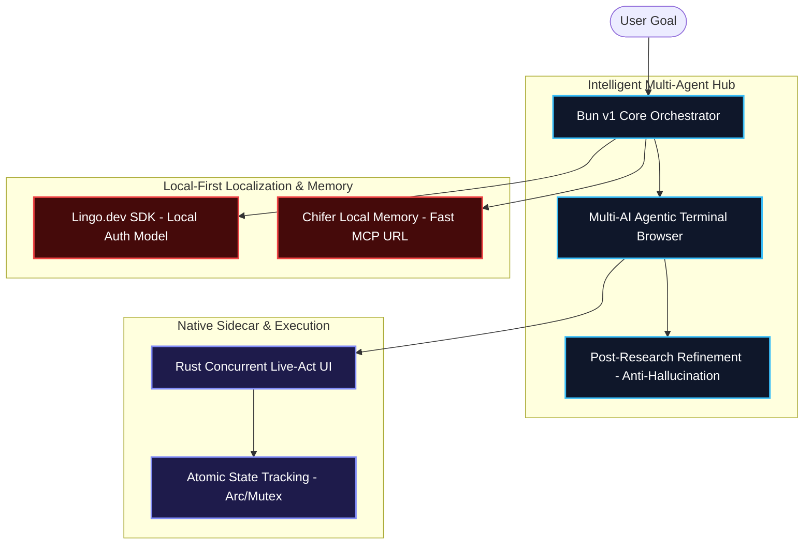
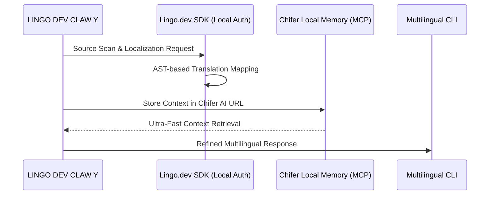
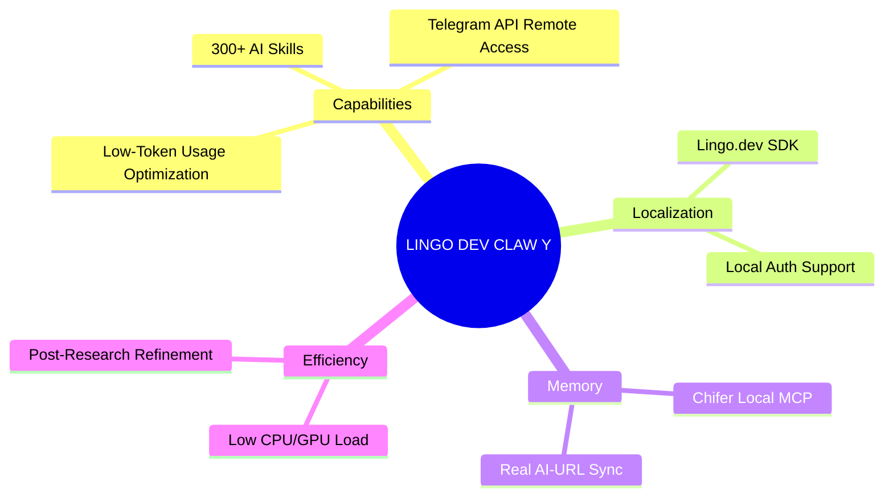

# 🌌 LINGO DEV CLAW Y (v1.0 - Demo Phase)
## [Official Innovation Pitch for Lingo.dev Hackathon #2]

> [!CAUTION]
> **Project Status:** This project is currently in **Demo V1.0 (Phase A)**. While the core architecture is robust, it is a prototype under active development. Some experimental features are being refined to reach production stability.

---

## 🏗 1. Supreme Hybrid Architecture (Multi-Agent System Context)
The system is built as an **Advanced Multi-AI Agentic Framework**, harmonizing a terminal-based environment with deep browser automation.



### **Core Technical Strengths:**
- **Resource Efficiency:** The terminal-based agentic browser significantly reduces CPU and GPU overhead, making it far more efficient than traditional GUI-based AI browsers.
- **Data Integrity:** We implemented a rigorous **Data Refinement Pipeline**. After research, the AI filters and validates information to eliminate "Fake Data" or hallucinations, ensuring only truthful outputs.
- **Token Efficiency:** Our logic is optimized to complete advanced tasks with minimal token consumption, significantly outperforming standard CLI agents.

---

## 🔍 2. Deep-Research & Task Execution (Cognitive Loop)
Our unique research logic ensures real-world solutions are generated in real-time.


---

## 🌍 3. Localization & Memory Integration (Lingo.dev & Chifer)
Direct integration with **Lingo.dev SDK** and **Chifer Local Memory**.

**Technical Deep-Dive:** 
The **Lingo.dev SDK** is integrated using a **Local Auth Model**, allowing for secure and local localization processing. Furthermore, we utilize **Chifer Local Auth AI URLs** for memory management, enabling **Chifer MCP** to sync and retrieve context with ultra-low latency.



---

## 🛠 4. Skill Matrix & Connectivity (300+ Modular Skills)
A massive ecosystem of **300+ autonomous AI skills** is baked into the system.


**Telegram API Integration:** The system can be accessed and controlled remotely using our custom **Telegram API** gateway, providing decentralized access to AI power.

---

## 📝 A Message from the Developer
> "This project is currently in its **Demo Stage**. While some features are still maturing, the research and data refinement engine is already exceptionally powerful. I am working tirelessly to evolve this system into a production-grade Agentic OS. I hope to provide you with a glimpse into the future of decentralized, efficient, and intelligent AI interaction. This is just the beginning."

---

## 🚀 GitHub Push & Submission Guide
Follow these steps to push the final project to GitHub and complete your hackathon submission:

### **1. Push to GitHub via Terminal**
Run the following commands in your project root:
```bash
# Add all changes
git add .

# Commit with a clear message
git commit -m "Final Submission - LINGO DEV CLAW Y v1.0 Demo"

# Push to your repository
git push origin main
```

### **2. Edit/Review on GitHub Web**
- Navigate to your repository URL.
- Ensure `README.md` and `HACKATHON_DOCS_BN.md` are visible.
- Use the **web editor** (press `.` on your keyboard while in the repo) if you need to make quick text adjustments to file headers or formatting.

### **3. Finalize Submission**
- Go to the hackathon dashboard.
- Submit your GitHub repository link.
- Upload high-resolution screenshots of the 4 complex diagrams from this document.

---
**LINGO DEV CLAW Y - "V1 Demo: Engineering the Future of Agentic AI."**
