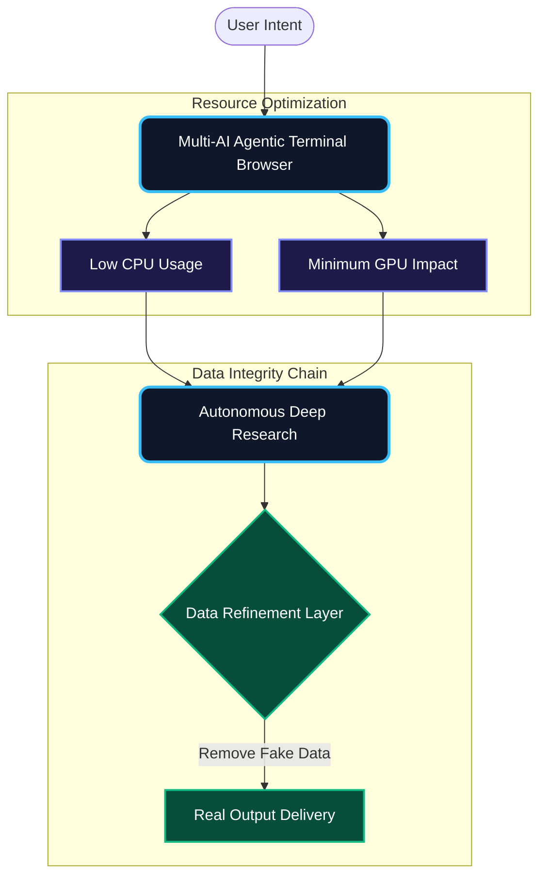
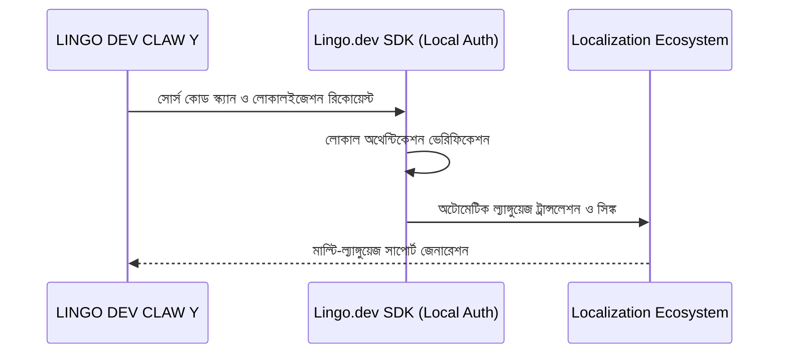
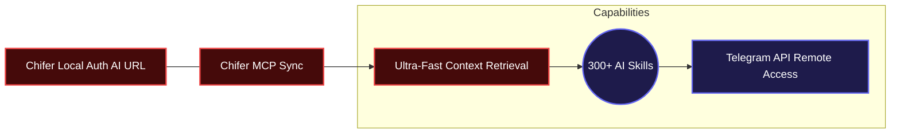
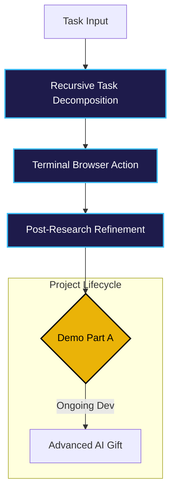

# 🌌 LINGO DEV CLAW Y (Demo Part A)
## [Lingo.dev Multilingual Hackathon #2 - Official Pitch]

> [!IMPORTANT]
> **প্রজেক্ট স্ট্যাটাস:** এই প্রজেক্টটি বর্তমানে **"Demo Part A"** পর্যায়ে আছে। এটি এখনো সম্পূর্ণ ডেভেলপমেন্ট শেষ করেনি, তবে এর কোর আর্কিটেকচার এবং রিসার্চ ইঞ্জিন বর্তমানে কার্যক্ষম এবং পরীক্ষার জন্য প্রস্তুত।

---

## 🏗️ ১. মাল্টি-এআই এজেন্টিক টার্মিনাল ব্রাউজার (Core Engine)
আমাদের সিস্টেমের প্রধান শক্তি হলো এর **Multi-AI Agentic Terminal Browser**। আমরা প্রচলিত ভারী GUI ব্রাউজারের বদলে টার্মিনাল-বেসড ব্রাউজিং ব্যবহার করি।


**কেন এটি ইউনিক?**  
- **রিসোর্স এফিশিয়েন্সি:** টার্মিনাল ব্রাউজার ব্যবহারের ফলে আপনার কম্পিউটারের CPU এবং GPU-এর ওপর চাপ অনেক কম পড়ে।  
- **নো ফেক ডেটা:** রিসার্চ শেষ করার পর এআই সংগৃহীত তথ্যগুলোকে রিফাইন করে। এর মাধ্যমে সব ধরণের ভুয়া তথ্য বা বিভ্রান্তিকর ডেটা দূর করে ইউজারকে একদম রিয়েল আউটপুট দেওয়া হয়।

---

## 🌍 ২. লোকালইজেশন এবং ল্যাঙ্গুয়েজ ইন্টিগ্রেশন (Lingo.dev)
আমরা **Lingo.dev SDK** কে এমনভাবে ইন্টিগ্রেট করেছি যা **Local Auth Model** ব্যবহার করে কাজ করতে সক্ষম।


**সুবিধা:** এটি সম্পূর্ণ লোকালি কাজ করতে পারে, ফলে আপনার কোড এবং অনুবাদ প্রোসেস অনেক বেশি নিরাপদ এবং দ্রুত হয়।

---

## 🧠 ৩. মেমরি সিস্টেম এবং স্কিলস ম্যাট্রিক্স (Chifer & 300+ Skills)
সিস্টেমটি অত্যন্ত দ্রুত কাজ করার জন্য আমরা **Chifer Local Auth AI URL** ব্যবহার করি। এর মাধ্যমে মেমরি এবং কনটেক্সট সিঙ্ক হয় চোখের পলকে।


**টোকেন সাশ্রয়:** এটি অন্যান্য সাধারণ CLI বটের তুলনায় অনেক কম টোকেন খরচ করে অনেক বেশি অ্যাডভান্সড কাজ সম্পন্ন করতে পারে। এছাড়া আমাদের **Telegram API** এর মাধ্যমে আপনি যেকোনো জায়গা থেকে আপনার এআই সিস্টেমকে কন্ট্রোল করতে পারবেন।

---

## 🛠️ ৪. সিস্টেম ফ্লো এবং ফিউচার রোডম্যাপ (The Logic Grid)
বর্তমানে এটি ডেমো পর্যায়ে থাকলেও, এর রিসার্চিং ক্ষমতা অতুলনীয়। আমরা খুব শীঘ্রই এর ফুল ভার্সন নিয়ে আসছি।



---
> **ডেভেলপার নোট:**  
> "আমি এই প্রজেক্টটি নিয়ে কাজ শুরু করে দিয়েছি। যদিও এটি এখন ডেমো পর্যায়ে, তবে ভবিষ্যতে আমি আপনাদের জন্য একটি 'অ্যাডভান্সড এআই উপহার' নিয়ে আসতে পারবো বলে আশা করছি। আমাদের রিসার্চ এবং ডেটা রিফাইনমেন্ট ইঞ্জিনটি এখনই অনেক শক্তিশালী, যা খুব দ্রুত আরও উন্নত হবে।"

---

## 🚀 গিটহাব এবং সাবমিশন গাইড

### **কিভাবে গিটহাবে এডিট করবেন?**
১. আপনার রিপোজিটরিতে গিয়ে যেকোনো ফাইলের ওপর ক্লিক করুন।  
২. ডানদিকের **Pencil আইকন (Edit)** এ ক্লিক করে সরাসরি কোড পরিবর্তন করতে পারবেন।  
৩. এডিট শেষ হলে নিচে **Commit changes** বাটনে ক্লিক করুন।

### **কিভাবে নতুন পরিবর্তন 'Pull' করবেন?**
আপনার পিসিতে লেটেস্ট কোড আপডেট করতে এই কমান্ডটি দিন:
```bash
git pull origin main
```

**আপনার সাকসেসফুল হ্যাকাথন সাবমিশনের জন্য শুভকামনা!**
