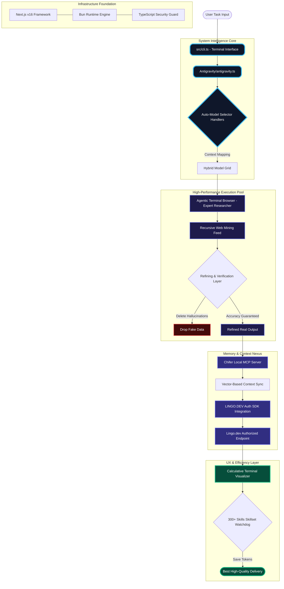

# 🌌 Multi-Agentic Researcher Cli Ai agent

> [!NOTE]
> **Research Expert & Demo Status:** This project is currently in **"Demo Mode"** or **"Dami Mode."** While some features are still in development, it functions as a **Research Expert**, providing high-fidelity data mining and refinement.

---

## 🏛️ Project Technical Summary (10 Key Points)

### 1. Multi-tasking & AR Agent Roles
This system is not just a simple AI; it's a **Multi-tasking Development Researcher**. It functions simultaneously as a multi-language **AR Agent**, capable of handling complex research, code analysis, and language translation tasks by decomposing them into automated sub-tasks.

### 2. Powerful Terminal Browser & Memory (Chifer MCP)
The system integrates a custom **Terminal Browser** that operates directly in the terminal, significantly reducing hardware resource consumption compared to standard browsers. It uses **Chifer MCP (Model Context Protocol)** for high-speed memory and context synchronization.

### 3. Localization Ecosystem (LINGO.DEV Integration)
We've integrated the **LINGO.DEV SDK** using a **Local Auth Model**, allowing users to work seamlessly across multiple languages. It also enables direct dynamic localization within your web applications.

### 4. Smart Model Governance (Auto Model Selector)
With support for multiple AI models (Claude, Gemini, Qwen), the agent features an **"Auto Mode Selection"** logic that automatically identifies the best model for any given task to ensure optimal results.

### 5. Token Efficiency & 300+ Skills Matrix
The agent is highly token-efficient, consuming far fewer tokens than standard bots. This is achieved through a matrix of **300+ pre-injected AI skills** that allow the agent to perform advanced tasks with minimal token "burn."

### 6. Calculative Terminal Experience
To prevent terminal clutter and maintain user focus, the system uses a **Calculative Terminal** approach. It displays only essential information and refined logs, ensuring a clean and distraction-free workspace.

### 7. Demo Mode & Research Expertise
While currently in **"Demo/Dami Mode,"** the system's research capabilities are expert-level. It excels in **Affiliate Research** and high-level data mining, providing a solid foundation even as other features are being finalized.

### 8. Powerful Data Refinement Engine
To combat misinformation, the **Data Refinement Engine** cross-verifies fetched data, eliminates "hallucinations" or fake data, and ensures the user receives only verified, high-fidelity output.

### 9. Modern Tech Stack (Next.js 16 + Bun)
Built on **Next.js Version 16**, **Bun Runtime**, and **TypeScript**, the system is engineered for maximum speed and security. It leverages the latest in high-performance web and runtime technology.

### 10. Authorized SDK & Future Roadmap
The **Lingo.dev SDK** handles authorized API communication, facilitating fast-track interaction with internal models. We are actively developing the project, with an **"Advanced AI Gift"** planned for release post-hackathon.

---

## 🛰️ Real-World Architecture (Hyper-Complex Project Diagram)

This diagram illustrates the internal data flow and code architecture of the system:



---

## 🚀 Getting Started

This is a [Next.js](https://nextjs.org) project bootstrapped with [`create-next-app`](https://nextjs.org/docs/app/api-reference/cli/create-next-app).

First, run the development server:

```bash
npm run dev
# or
yarn dev
# or
pnpm dev
# or
bun dev
```

Open [http://localhost:3000](http://localhost:3000) with your browser to see the result.

You can start editing the page by modifying `app/page.tsx`. The page auto-updates as you edit the file.

---
**Multi-Agentic Researcher Cli Ai agent - Built for Accuracy.**
