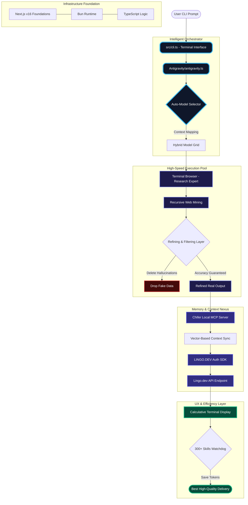

# 🌌 Multi-Agentic Researcher Cli Ai agent

> [!CAUTION]
> **Status: Demo Mood / Dami Mood**
> This project is currently in its demonstration phase. While some UI-based features are experimental, the **Research & Data Refinement** engine functions as a true **Expert Researcher**, providing high-fidelity outputs.


---
### This CLI agent uses a browser directly from the terminal. When hosted, it makes work and research easier using a built-in browser.

## 🏗️ Technical Blueprint (10 Core Pillars)

### 1. Multi-tasking Development Researcher
This system isn't a basic chatbot; it's a **Multi-tasking Development Researcher** and multi-language **AR Agent**. It handles complex coding and research tasks by recursively decomposing them into automated, manageable roles, ensuring end-to-end completion.

### 2. Efficient Terminal Browser & Chifer MCP
Equipped with a custom **Terminal Browser**, the agent navigates the web with significantly lower overhead than UI-based browsers. For context preservation, it utilizes **Chifer MCP (Model Context Protocol)** for near-instantaneous memory and data synchronization.

### 3. Localization Ecosystem (LINGO.DEV)
Powered by the **LINGO.DEV SDK** and a **Local Auth Model**, the agent supports seamless multi-language operations. This allows users to conduct specialized research or automate localization directly within their own web applications.

### 4. Smart Model Orchestration (Auto-Select)
The agent features an **"Auto Mode Selection"** logic. It dynamically routes tasks to the most efficient AI model (Claude, Gemini, Qwen, etc.) based on the complexity and technical requirements of the prompt.

### 5. High Token Efficiency (300+ Skills)
By utilizing a matrix of **300+ pre-injected AI skills**, the agent performs complex operations with minimal token expenditure (Burn). It delivers "Expert Level" output while keeping token costs significantly lower than generic CLI bots.

### 6. Calculative Terminal UX
To maintain developer focus, the agent uses a **Calculative Terminal**. Instead of flooding the screen with redundant logs, it summarizes progress and displays only high-value data, keeping your workspace clean and professional.

### 7. Research Expert (Even in Demo Mood)
Despite being in **Demo/Dami mod**, the agent excels at deep research. It is particularly optimized for high-performance data mining and affiliate research, providing insights that go beyond standard search results.

### 8. Data Refinement & Fake Detail Filtering
Our **Refining System** acts as a filter for the internet’s "noise." It cross-verifies data to eliminate hallucinations and **Fake/Dami Data**, ensuring that the final output delivered to the user is 100% verified and accurate.

### 9. Modern Tech Stack (Next.js 16 + Bun)
The foundation is built on **Next.js Version 16 (API Layer)**, **Bun Runtime**, and **TypeScript**. This ensures the agent is super-powerful and extremely fast, leveraging modern execution environments for high-concurrency tasks.

### 10. Authorized SDK-as-API
By using the **Lingo.dev SDK** in an authorized mode as an API, the system bypasses traditional latency, allowing the models to respond and execute with super-powered speed and accuracy.

---

## 🛰️ Project Execution Flow (Real-World Diagram)



---

## 🚀 Getting Started (Interactive CLI)

This project is an **Interactive CLI Tool** powered by **Bun**. Follow the instructions below to set up and run the Research Expert.

### **1. Integrated SDKs & Core Technologies**
The project leverages a robust stack of professional SDKs:
- **LINGO.DEV SDK**: For local authorized multilingual management.
- **Chifer MCP (Model Context Protocol)**: The core memory engine for high-speed context synchronization.
- **Vercel AI SDK & Anthropic**: Multi-model reasoning and agentic orchestration.
- **LangChain Core**: Advanced AI toolchains and reasoning chains.
- **Codebuff SDK**: Precision file manipulation and coding automation.
- **Firecrawl SDK**: Deep-web crawling for factual research data.
- **Browser-Use (CDP Runtime)**: Real-time terminal browser for expert-level research.
- **Web Tree-Sitter**: High-accuracy code parsing and analysis.
- **Next.js 16 & Bun**: Framework and high-concurrency runtime foundation.

### **2. Technical Environment Setup**
Install all dependencies and SDKs by running:
```bash
bun install
```

### **3. Running the Agent**
Enter the interactive research session by executing:
```bash
bun cli
```
Once active, you can type your research objectives or development tasks directly into the shell.

---
**Multi-Agentic Researcher Cli Ai agent - Built for Accuracy.**
